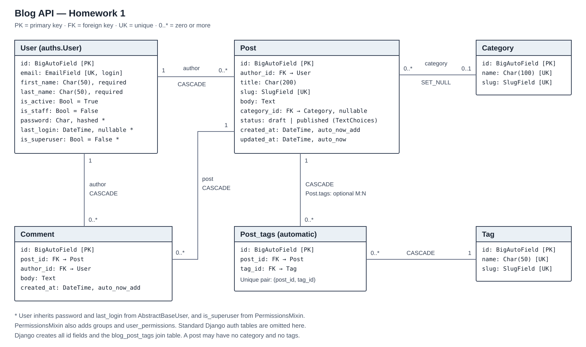

# Blog API — Homework 1

Небольшой учебный REST API на Django и Django REST Framework.
Пользователь входит по email и паролю, получает JWT и может создавать посты
и комментарии. Основная часть работы — модели и связи между ними.

## ERD

Диаграмма создана отдельным коммитом до реализации моделей.



Исходник диаграммы: [docs/erd.mmd](docs/erd.mmd).
Таблицу связи постов и тегов Django создаёт автоматически.

## Запуск

Проверено с Python 3.12. Команды ниже для PowerShell и `uv`.

```powershell
git clone https://github.com/jsdont/blog-api.git
cd blog-api
uv venv --python 3.12 .venv
uv pip install --python .venv/Scripts/python.exe -r requirements/dev.txt
Copy-Item settings/.env.example settings/.env
```

Сгенерируй ключ следующей командой и вставь результат в
`BLOG_SECRET_KEY` внутри `settings/.env`:

```powershell
.venv/Scripts/python.exe -c "import secrets; print(secrets.token_urlsafe(64))"
```

Оставь `BLOG_ENV_ID=local`, затем выполни:

```powershell
.venv/Scripts/python.exe manage.py migrate
.venv/Scripts/python.exe manage.py createsuperuser
.venv/Scripts/python.exe manage.py runserver
```

При создании пользователя введи email, имя, фамилию и пароль.
API: <http://127.0.0.1:8000/api/>.
Админка: <http://127.0.0.1:8000/admin/>.
Обычных пользователей можно создать через админку, без флага `is_staff`.

Если используешь обычный Python вместо `uv`, создай окружение командой
`python -m venv .venv`, а зависимости установи через
`.venv/Scripts/python.exe -m pip install -r requirements/dev.txt`.

## Структура

```text
blog-api/
├── manage.py
├── .gitignore
├── requirements/
│   ├── base.txt
│   ├── dev.txt
│   └── prod.txt
├── logs/                  # создаётся при запуске, не попадает в Git
├── apps/
│   ├── auths/              # пользователь, менеджер, JWT
│   └── blog/               # категории, теги, посты, комментарии
├── settings/
│   ├── .env                # локальные секреты, не попадают в Git
│   ├── .env.example        # пример без настоящего ключа
│   ├── conf.py
│   ├── base.py
│   ├── constants.py
│   ├── urls.py
│   ├── wsgi.py
│   ├── asgi.py
│   └── env/
│       ├── local.py
│       └── prod.py
└── docs/
    ├── erd.svg
    └── erd.mmd
```

`manage.py` читает `BLOG_ENV_ID` из `settings/.env` и выбирает окружение.
Для `local` загружается `settings/env/local.py`, затем `base.py`, затем
`conf.py`, который читает остальные переменные через `python-decouple`.
Локально используется SQLite и `DEBUG=True`.

В `prod.py` настроены PostgreSQL и `DEBUG=False`. Для этого окружения
нужно установить `requirements/prod.txt`, создать базу PostgreSQL и заполнить
`BLOG_DB_*`, `BLOG_ALLOWED_HOSTS`, `BLOG_SECRET_KEY`, `BLOG_ENV_ID=prod`.
Проверки этой работы выполнялись на SQLite; подключение к реальной
PostgreSQL не проверялось. Развёртывание на сервере в эту работу не входит.

## Запросы к API

| Адрес | Методы | Назначение |
| --- | --- | --- |
| `/api/auth/token/` | POST | Получить access и refresh по email и паролю |
| `/api/auth/token/refresh/` | POST | Получить новый access по refresh |
| `/api/categories/` | GET, POST | Список и создание категорий |
| `/api/tags/` | GET, POST | Список и создание тегов |
| `/api/posts/` | GET, POST | Список и создание постов |
| `/api/comments/` | GET, POST | Список и создание комментариев |

Для категорий, тегов, постов и комментариев адрес с числовым ID, например
`/api/posts/1/`, поддерживает GET, PUT, PATCH и DELETE.

Опубликованные посты видны всем, черновики — только их автору.
Посты и комментарии создаёт вошедший пользователь; менять и удалять их
может только автор. Автор подставляется из токена, передавать его ID не нужно.
Категории и теги изменяет сотрудник (`is_staff=True`). Комментарий можно
добавить только к опубликованному посту; переносить его на другой пост нельзя.
Это простые правила доступа, выбранные для этого API: в задании подробные
права и адреса запросов не перечислены.

Пример в PowerShell: укажи email созданного пользователя. Пароль запрашивается
отдельно, чтобы не оставлять его в истории команд.

```powershell
$login = @{
    email = "student@example.com"
    password = (Get-Credential -UserName "student@example.com" -Message "Blog password").GetNetworkCredential().Password
} | ConvertTo-Json
$tokens = Invoke-RestMethod -Method Post `
    -Uri "http://127.0.0.1:8000/api/auth/token/" `
    -ContentType "application/json" -Body $login
$headers = @{ Authorization = "Bearer $($tokens.access)" }

$post = @{
    title = "My first post"
    slug = "my-first-post"
    body = "Hello! This is my first blog post."
    status = "published"
} | ConvertTo-Json
$created = Invoke-RestMethod -Method Post `
    -Uri "http://127.0.0.1:8000/api/posts/" `
    -Headers $headers -ContentType "application/json" -Body $post

$comment = @{ post = $created.id; body = "My first comment" } | ConvertTo-Json
Invoke-RestMethod -Method Post `
    -Uri "http://127.0.0.1:8000/api/comments/" `
    -Headers $headers -ContentType "application/json" -Body $comment
```

`slug` задаётся вручную и должен быть уникальным. Если не указать `status`,
пост сохраняется как `draft`. Категория необязательна, список тегов может быть
пустым. Если они нужны, передай `category` как ID, а `tags` как список ID.

## Проверка

```powershell
.venv/Scripts/ruff.exe check .
.venv/Scripts/ruff.exe format --check .
.venv/Scripts/python.exe manage.py check
.venv/Scripts/python.exe manage.py makemigrations --check --dry-run
.venv/Scripts/python.exe manage.py test
```

Тесты проверяют создание пользователей, хеширование пароля, вход по email,
JWT, связи моделей и доступ к записям. Лимиты длины полей вынесены в константы,
статусы постов — в `TextChoices`. В функциях есть аннотации типов.

## Что объяснить на защите

- `models.py` описывает таблицы. Миграции создают их в базе данных.
- `UserManager` создаёт пользователя: приводит email к нижнему регистру,
  проверяет обязательные данные и вызывает `set_password` для хеширования.
- `AUTH_USER_MODEL = "auths.User"` говорит Django использовать нашу модель.
  Эта настройка добавлена до первой миграции.
- `ForeignKey` связывает много записей с одной. Например, у автора много постов.
  `ManyToManyField` позволяет посту иметь несколько тегов, а тегу — несколько постов.
- `CASCADE` удаляет связанные записи. `SET_NULL` при удалении категории оставляет
  пост, но очищает его категорию.
- `serializers.py` проверяет входные данные и преобразует модели в JSON.
  `views.py` обрабатывает запросы, а `urls.py` связывает их с адресами.
- `permissions.py` проверяет права. JWT нужен для определения пользователя
  при запросе; access передаётся в заголовке `Authorization: Bearer ...`.
- `.env` хранит настройки и секреты отдельно от кода. В репозитории есть только
  `.env.example` с примером значений.

Работа выполняется в ветке `hw1`, затем вливается в `main`.
Ветка `hw1` сохраняется для сдачи и последующих домашних работ.

Документация: [Django: custom user](https://docs.djangoproject.com/en/5.2/topics/auth/customizing/),
[DRF: viewsets](https://www.django-rest-framework.org/api-guide/viewsets/),
[SimpleJWT](https://django-rest-framework-simplejwt.readthedocs.io/en/stable/getting_started.html).
